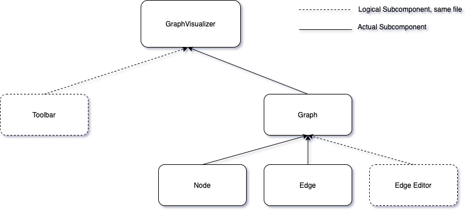
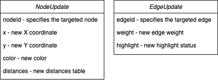
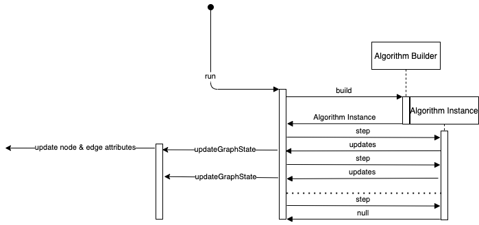
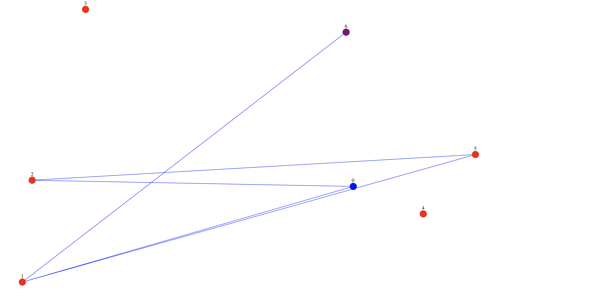
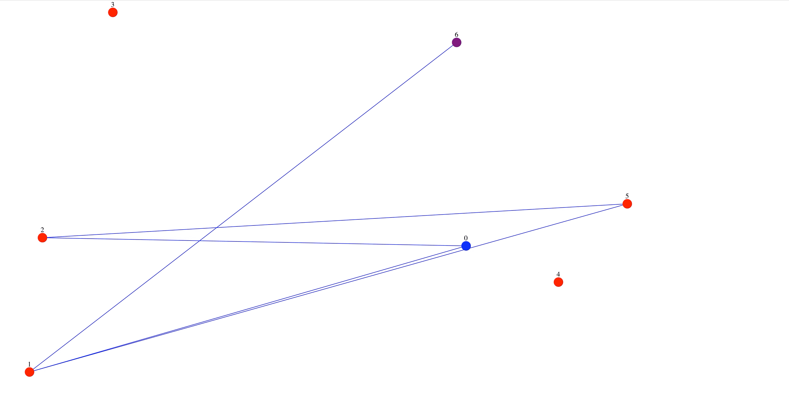
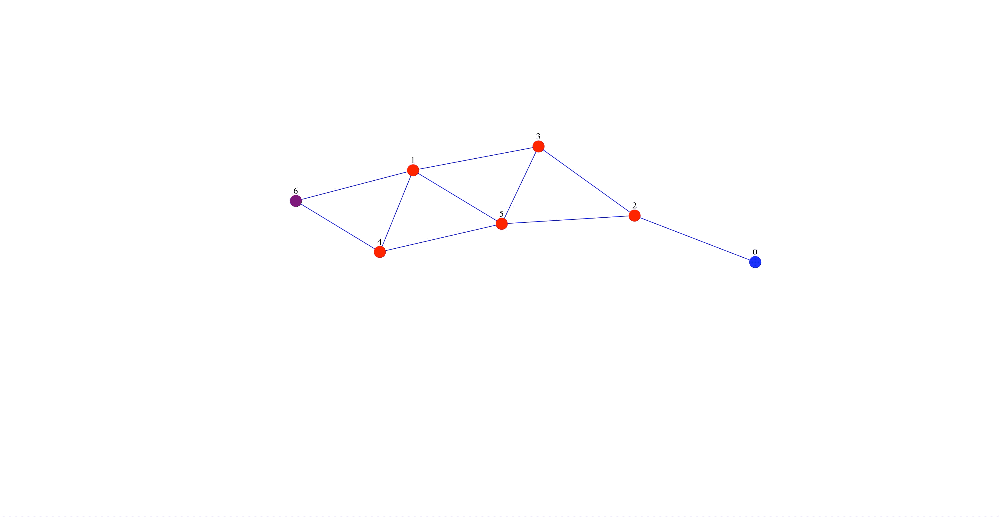
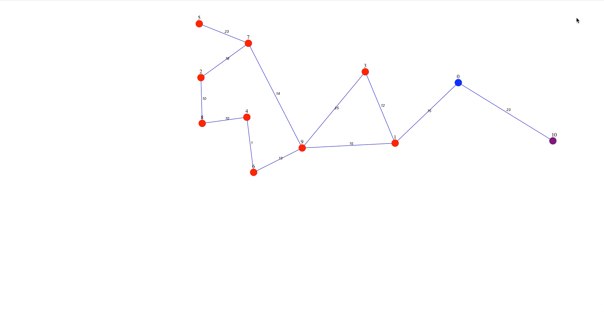
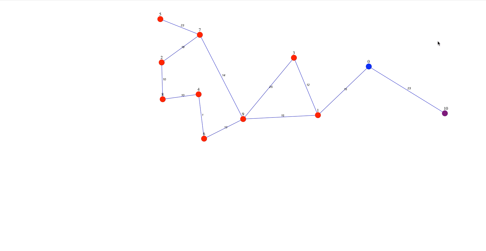
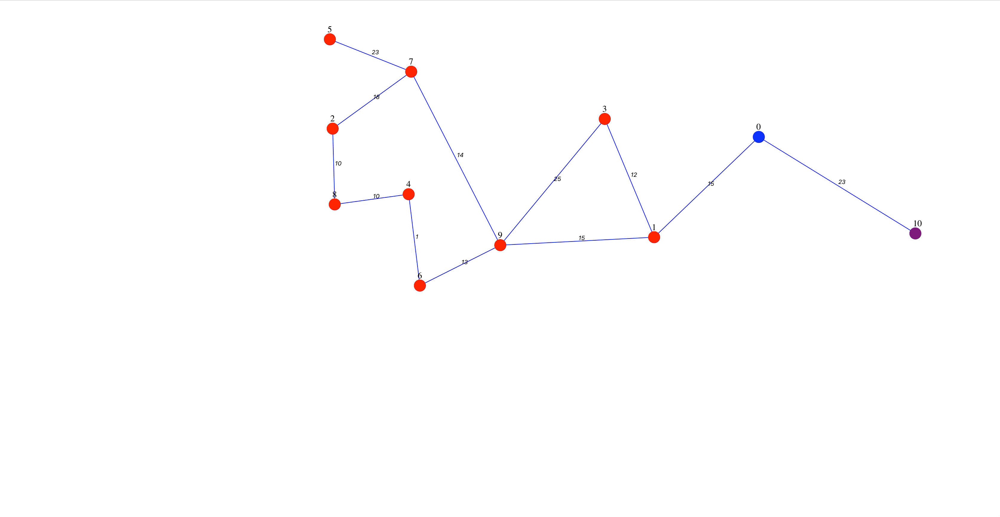
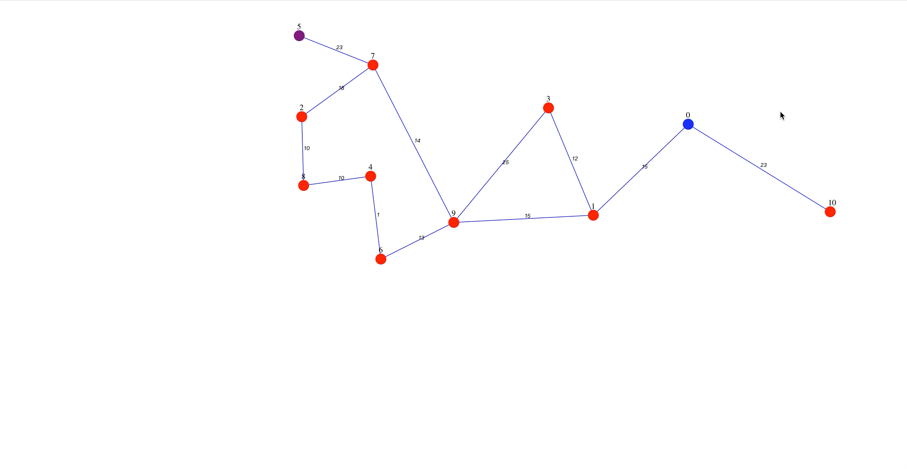

* [Introduction](#introduction)
* [Dependencies](#dependencies)
* [Implementation](#implementation)
    * [Project Architecture](#project-architecture)
    * [Algorithms](#algorithms)
        * [Graph generation](#graph-generation)
            * [Random Layout](#random-layout)
            * [Fruchterman-Reingold force-directed algorithm](#fruchterman-reingold-force-directed-algorithm)
        * [Unweighted Search Algorithms](#unweighted-search-algorithms)
            * [Depth-First Search](#depth-first-search)
            * [Breadth-First Search](#breadth-first-search)
        * [Weighted Uninformed Search Algorithms](#weighted-uninformed-search-algorithms)
            * [Bellman-Ford](#bellman-ford)
            * [Dijkstra](#dijkstra)
            * [Floyd-Warshall](#floyd-warshall)
        * [Weighted Informed Search Algorithms](#weighted-informed-search-algorithms)
            * [A*](#a)
* [Lessons learned &amp; potential future work](#lessons-learned--potential-future-work)
* [Known Issues](#known-issues)

# Introduction

The "Graph Algorithms Visualized" project is aimed to offer a more intuiitive understanding of how graph algorithms work through an editable graphical interface that lets you run select algorithms on randomly generated, customizable graphs.

Some core features include:
- random generation of graphs for given node counts and densities
- nodes are fully movable by dragging them in the interface
- edges can be added between any pair of nodes
- the graph can be both directed and undirected, weighted and unweighted
- source and destination nodes can be specified

Algorithms that are currently supported are:
- **Layout**: the Fruchterman-Reingold Force-Directed layout algorithm
- **Unweighted Search Algorithms**: Depth-First Search (DFS) and Breadth-First Search (BFS)
- **Weighted, uninformed search algorithms**: Bellman-Ford, Floyd-Warshall & Dijkstra
- **Weighted, informed search algorithms**: A*

# Dependencies
Dependencies are specified in the *package.json* file. The project was built in ReactJS using a minimal number of external dependencies, most of which are visual aids.

# Implementation

## Project Architecture

The project has three logical components, correspdoning to a Model-View-Controller paradigm. The model of the data (i.e., the graph state) is controlled by various algorithm implementations and editor logic and is visually rendered by a third component, that handles graph drawing through node and edge rendering using SVG.

From a top-down perspective, the GraphVisualizer is comprised of the header of the website, a Toolbar that allows the user to set up the graph and algorithm combination they wish to visualize, and a Graph component that renders the actual data structure.

The toolbar allows the user to specify the number of nodes in the graph, the sparsity of the graph (i.e., a probability of an edge between two nodes to exist). In addition, the user specifies the algorithm they wish to visualize as well as the animation delay. Finally, buttons are present which allow the user to change a randomly generated graph topology by adding a new edge and selecting different source and target nodes.

The graph component is composed of node and edge instances, that are drawn using SVG, and acts as an intermediary notifying edges of node position changes, as well as controlling the logic for both graph regeneration, as well as edge editing.

The user is able to drag nodes around, as well as click on edges in order to open up an edge editor that allows them to both delete an edge and change its weight.

Nodes are represented as circles, with an associated ID and color. The color represents various possible node states: red (default), blue (source node), purple (target node), yellow ("open", or active, node) and green (closed, or processed, node). In addition, nodes also contain a table of distances that is rendered near it and represents the sum of weights along the currently known optimal path to another node. For the Floyd-Warshall algorithm, every node has such a table while for other algorithms only the source node will have this.

Edges are represented as lines. For directed edges, a gradient that starts with higher transparency at the source and ends with full opacity at the target node is used together with the traditional arrow indicator. For undirected edges, a simple line is used. Edges can be highlighted when they are being considered in an algorithm, which changes their colors fromb blue to green. An edge can be clicked, which will cause the Graph component to display an editor box near the edge's center position which allows the user to delete the edge or change its weight. Clicking on an edge doesn't require an exact click, with an invisible line of a significantly larger width overlapping the edge that also registers the clicks. This ensures that approximate clicks on the line will cause the editor box to open. The editor box will disappear when a click is registered anywhere else on the graph visualization frame.

Algorithms interact with the visualization logic indirectly, through NodeUpdates and EdgeUpdates. Below, the attributes of these at the time of this writing can be seen:

With the exception of the id's that specify which node/edge to alter, all other attributes can be undefined.

These update data structures are then processed by the Graph component which will cause the appropriate rendering changes to occur. The algorithms and the visualization are thus logically separated, allowing for the easy implementation of any number of algorithms.

The flow of an algorithm visualization is presented in the following diagram:

## Algorithms

### Graph generation
Generating nodes spread out uniformly would produce well distanced nodes, however it would not take into account the topology of the graph.

Various layout algorithms exist, of which the following are implemented in this project:
- Random Layout
- [Fruchterman-Reingold force-directed algorithm](#fruchterman-reingold-force-directed-algorithm).

##### Random Layout
Nodes are randomly generated in the graph visualization area.
An edge between a pair of nodes exists with a probability given by the sparsity:

##### Fruchterman-Reingold force-directed algorithm
In this class of algorithms, nodes apply attraction and repulsion forces between each other. In this algorithm, the forces are given by [1]:

, for attraction
, for repulsion
where *d* is the distance between a pair of vertices and k, the optimal distance between a pair of vertices, is defined as:
, with C being some scaling constant.

In addition to these, the algorithm in this implementation was modified to space out nodes more by adding an additional scaling factor that increased repulsion forces and decreased attraction forces:

, for attraction
, for repulsion

Where *RI* is the "repulsion_increase" constant which was empirically chosen to be 10 meaning that repulsion forces are 10 times stronger in this implementation while attraction forces are 10 times weaker, leading to more spread out layouts.

[1] http://cs.brown.edu/people/rtamassi/gdhandbook/chapters/force-directed.pdf

### Unweighted Search Algorithms
These algorithms are able to find paths between nodes, however they are not designed to find the optimal path on weighted graphs. The two algorithms implemented in this project are the classical Depth-First Search and the Breadth-First Search algorithms.

##### Depth-First Search

In DFS nodes are explored starting from the "source" node (the default being the node indexed as 0). At each iteration of DFS, one of the neighbours of the current node is chosen and then explored recursively using DFS. In the implementation found in this project, the recursion is simulated using a stack.

[2] https://en.wikipedia.org/wiki/Depth-first_search

##### Breadth-First Search

The difference between DFS and BFS is that BFS will explore the graph on "levels". Starting from the source node, all neighbouring nodes are considered followed by their neighbours (i.e., the rank-2 neighbours of the source node) and so on. In practice, this means that the BFS implementation uses a queue instead of a stack to decide the exploration order.

[3] https://en.wikipedia.org/wiki/Breadth-first_search

### Weighted Uninformed Search Algorithms

The algorithms in this section are meant to be run on weighted graphs. All the algorithms present are designed to find minimal paths in the graph between nodes. The fundamental concept underlying all these algorithms is *edge relaxation* in which a path between a pair of nodes  may be improved through relaxing an edge  such that the path  can have a lower cost by passing through u': .

Thus, through successive edge relaxations we can find the optimal path between a pair of nodes.

[4] Cormen, T. H., Leiserson, C. E., Rivest, R. L., & Stein, C. (2009). Introduction to algorithms. MIT press.

##### Bellman-Ford

The Bellman-Ford algorithm is designed to find the shortest path from some source node to all others. Initially, the distances from the source node are all set to infinity (with the exception of the distance of the source node to iself, which is set to 0). The algorithm states that performing |V| - 1 cycles of edge relaxations, where each edge  is considered for improving the distance to node *v* by passing through *u*: . 

[5] https://en.wikipedia.org/wiki/Bellman%E2%80%93Ford_algorithm

##### Dijkstra

In Dijkstra's algorithm instead of performing |V| - 1 relaxation steps for all edges, a priority queue is used so that at each iteration the edges of the node with the shortest distance to the source is considered. What this means in practice is that once a node has been fully explored (i.e., removed from the priority queue) then the distance between the source node and it will be stable (i.e., optimal). In this project's implementation, this is reflected by the node becoming green in the visualization.

[6] https://en.wikipedia.org/wiki/Dijkstra%27s_algorithm

##### Floyd-Warshall

Floyd-Warshall differs from the two previous algorithm by computing the distances between all pairs of node simultaneously, instead of only computing the distances between some source node and all others. This is done by evaluating each node  as an intermediate for all paths . This means that the edge (u, k) is relaxed in order to improve path . In this project, the nodes that are being considered as intermediates are marked as green and the pairs of nodes are marked as yellow. When the intermediate node is used to improve a path, the entire path is highlighted.

[7] https://en.wikipedia.org/wiki/Floyd%E2%80%93Warshall_algorithm

### Weighted Informed Search Algorithms
##### A*

The A* search algorithm is a graph traversal algorithm that can be used to find the optimal path between a source node and a target node. This is an *informed* algorithm, in the sense that it uses prior information to find the optimal path. In the case of this project, the prior information the A* algorithm is given consists of the unweighted distances between the destination node and all other nodes. In essence, A* uses a heuristic that tells it how far away a node is from the destination along an unweighted shortest path. A* then operates similarily to Dijkstra, wherein a priority queue is used to pick the *best* node to evaluate at a certain step using the sum between the distance from the source node and the estimated distance to the destination node as the priority criteria. In the visualization, the distances displayed above the source node have the following format:  with  being the actual distance to the source node and  being the estimated distance to the destination node. Once the destination node is popped from the priority queue, the algorithm stops.

[7] https://en.wikipedia.org/wiki/A*_search_algorithm

# Lessons learned & potential future work
- Currently, updates to nodes require notifications to be sent from the node instance to the graph controller, which then finds and notifies the inbound edges of the node to alter their coordinates. This may be streamlined using something like [React Redux](https://redux.js.org/introduction/getting-started).
- The current implementation of the algorithms uses data structures that aren't optimal in some cases. This was done monstly so that a unified data format can be used across all algorithms and editing methods. Ideally, adapters could be used to convert node/edge lists into various formats that can more easily be used by the various components (e.g., Dijkstra's algorithms benefits from having the graph represented as an adjacency list instead of a list of edges).
- Currently, tests exist only for the *PriorityQueue* implementation and are run using jest, although there is a clear benefit to extending test coverage for the graph algorithms, at the very least. Ideally, the visualization modules should also be tested using something like [Storybook JS](https://storybook.js.org/docs/testing/react-ui-testing/).

# Known Issues
- sometimes edges disappear during Fruchterman-Reingold at the bottom of the screen when the developer tools console is opened on Chrome